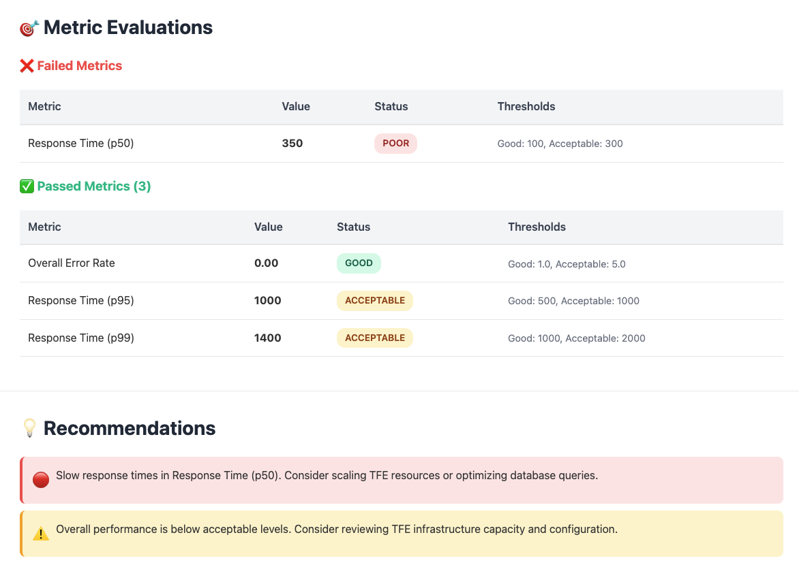
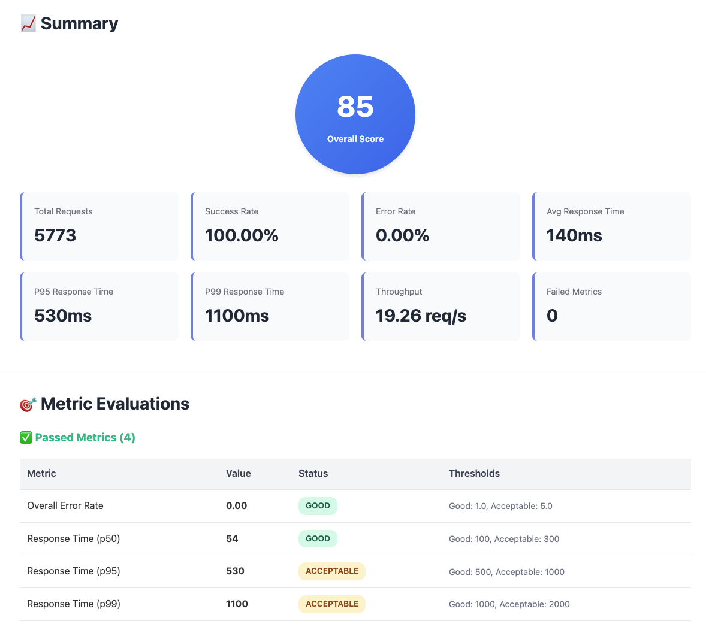

# TFE Load Testing Framework

A comprehensive, open-source load testing framework specifically designed for **Terraform Enterprise (TFE)** using [Locust.io](https://locust.io/). This framework helps customers evaluate and optimize their TFE deployments under various load conditions.

> **⚠️ Disclaimer:** This project is community-developed and is **not officially supported or maintained by HashiCorp or IBM**. It is provided as-is, with no guarantees of correctness, safety, security, or fitness for any particular purpose. Use at your own risk against non-production environments first, and always review the code before running it against your infrastructure. See the [License](LICENSE) for full terms.

> **🚀 New to the framework?** Start with the [Quick Start Guide](docs/QUICKSTART.md) for a 5-minute setup!


## 🎯 Purpose

This framework provides:
- Realistic TFE workload simulation
- Performance bottleneck identification
- Infrastructure capacity validation
- Performance baselines and benchmarks

## 🚀 Quick Start

### Prerequisites

- Python 3.11 or higher
- [Task](https://taskfile.dev/) (recommended) - Install via: `brew install go-task/tap/go-task`
- TFE instance (local or remote)
- TFE API token
- TFE organization

> **💡 Tip:** This framework uses [Task](https://taskfile.dev/) as the primary task runner. While you can use direct commands, Task provides a simpler, more consistent interface. All examples below show both Task and direct command approaches.

### Installation

1. **Clone the repository**
   ```bash
   git clone <repository-url>
   cd tfe-load-testing-framework
   ```

2. **Install Task (recommended)**
   ```bash
   # macOS
   brew install go-task/tap/go-task
   
   # Linux
   sh -c "$(curl --location https://taskfile.dev/install.sh)" -- -d -b ~/.local/bin
   
   # Windows (via Scoop)
   scoop install task
   ```

3. **Set up the environment**
   ```bash
   python3 -m venv venv
   source venv/bin/activate  # On Windows: venv\Scripts\activate
   pip install -r requirements.txt
   cp .env.example .env
   # Edit .env with your TFE credentials
   ```

### Running Your First Load Test

**Option 1: Using Task (recommended)**
```bash
# Run all test scenarios with analysis
task test:all

# Run individual test scenarios
task test:workspace
task test:run
task test:state

# Run with custom parameters
task test:workspace -- --users 50 --spawn-rate 5 --run-time 10m

# Run with web UI for interactive testing
./examples/run_workspace_test.sh web
```

**Option 2: Run all tests sequentially**
```bash
# Run all test scenarios with analysis
./run_all_tests.sh

# Custom configuration
./run_all_tests.sh --users 50 --spawn-rate 5 --run-time 10m

# With Grafana metrics
./run_all_tests.sh --with-grafana --grafana-url http://localhost:3000
```

See [docs/RUN_ALL_TESTS.md](docs/RUN_ALL_TESTS.md) for complete documentation.

**Option 3: Run individual tests with shell scripts**
```bash
# Headless mode (automated run)
./examples/run_workspace_test.sh

# Web UI mode (interactive)
./examples/run_workspace_test.sh web
```

**Option 4: Direct Locust command**
```bash
# Set environment variables
export TFE_HOSTNAME=tfe.localdemo.me
export TFE_TOKEN=your-token-here
export TFE_ORGANIZATION=your-org

# Run test
locust -f src/locustfiles/workspace_operations.py \
    --host https://tfe.localdemo.me \
    --users 10 \
    --spawn-rate 2 \
    --run-time 5m \
    --headless \
    --html reports/report.html
```

## 📁 Project Structure

```
tfe-load-testing-framework/
├── src/
│   ├── locustfiles/               # Locust test scenarios
│   │   ├── workspace_operations.py       # Workspace lifecycle tests
│   │   ├── run_operations.py             # Run lifecycle and queue tests
│   │   ├── state_operations.py           # State management tests
│   │   └── sentinel_policy_operations.py # Sentinel policy evaluation tests
│   ├── utils/                     # Utility modules
│   │   └── tfe_client.py          # TFE API client wrapper
│   └── analysis/                  # Results analysis and reporting
├── config/
│   └── tfe_config.yaml.example    # Configuration template
├── .env.example                   # Environment variables template
├── examples/
│   ├── run_workspace_test.sh          # Workspace test runner
│   ├── run_run_operations_test.sh     # Run operations test runner
│   ├── run_sentinel_policy_test.sh    # Sentinel policy test runner
│   └── run_state_operations_test.sh   # State operations test runner
├── platform/
│   └── tfe/                 # Local TFE development environment
│       └── monitoring/      # Prometheus, Grafana, exporters
├── reports/                 # Generated test reports
├── docs/                    # Documentation
└── requirements.txt         # Python dependencies
```

## 🧪 Available Test Scenarios

### 1. Workspace Operations (✅ Implemented)

Tests basic workspace lifecycle operations:
- **Create workspaces** - Simulates rapid workspace creation
- **List workspaces** - Tests pagination and filtering
- **Get workspace details** - Validates individual workspace retrieval
- **Delete workspaces** - Tests cleanup operations

**Configuration:**
```bash
# Environment variables
TFE_HOSTNAME=tfe.localdemo.me
TFE_TOKEN=your-token
TFE_ORGANIZATION=your-org
CLEANUP_WORKSPACES=true

# Locust parameters
LOCUST_USERS=10
LOCUST_SPAWN_RATE=2
LOCUST_RUN_TIME=5m
```

**Task Weights:**
- Create workspace: 10 (most frequent)
- List workspaces: 5
- Get workspace details: 3
- Delete workspace: 2

### 2. Run Operations (✅ Implemented)

Tests Terraform run lifecycle and queue management:
- **Create and upload configuration versions** - Generates and uploads Terraform configs
- **Trigger runs** - Creates plan and apply runs
- **Monitor run status** - Polls run progress
- **Queue multiple runs** - Tests queue depth handling
- **Cancel runs** - Tests run cancellation

**Run the test:**
```bash
./examples/run_run_operations_test.sh
```

**Task Weights:**
- Create and trigger run: 10 (most frequent)
- Monitor run status: 8
- Queue multiple runs: 3
- Cancel run: 2

### 3. State Operations (✅ Implemented)

Tests state management and file handling:
- **Upload state files** - Creates and uploads state versions
- **Download current state** - Retrieves latest state
- **List state versions** - Views state history
- **Download specific versions** - Retrieves historical state
- **Handle large state files** - Tests performance with large files

**Run the test:**
```bash
./examples/run_state_operations_test.sh
```

**Task Weights:**
- Upload state: 10 (most frequent)
- Download current state: 8
- List state versions: 5
- Download specific version: 3
- Upload large state: 2

### 4. Sentinel Policy Evaluation (✅ Implemented)

Tests Sentinel policy evaluation and enforcement:
- **Policy pass scenarios** - Runs that pass policy checks
- **Policy fail scenarios** - Runs that fail policy checks
- **Policy override workflow** - Testing soft-mandatory policy overrides
- **Multiple enforcement levels** - Advisory, soft-mandatory, hard-mandatory
- **Policy check monitoring** - Tracking policy-stage wall time, engine duration when available, and outcomes

**Run the test:**
```bash
# Recommended local/default run.
# Uses loadtest-policies-synthetic-heavy, auto-created and kept idempotent.
task test:sentinel -- --run-time=5m

# Equivalent direct script call
./examples/run_sentinel_policy_test.sh

# Benchmark your own policy set instead of the synthetic sample policies
export TFE_POLICY_SET_NAME=my-custom-policy-set
./examples/run_sentinel_policy_test.sh

# Use the lighter standard sample policies
./examples/run_sentinel_policy_test.sh --policy-profile standard --policy-set loadtest-policies

# Increase the synthetic workload when local policy stages complete too quickly
./examples/run_sentinel_policy_test.sh --synthetic-resource-count 300 --heavy-policy-scan-count 150
```

**Policy Set Behavior:**
- **Default (`loadtest-policies-synthetic-heavy`)**: Auto-created when missing and re-used on subsequent runs. It contains the standard sample policies plus a synthetic-heavy advisory policy.
- **Standard (`loadtest-policies`)**: Available with `--policy-profile standard --policy-set loadtest-policies` for a lighter functional smoke test.
- **Custom name**: Must already exist in TFE. Use this for representative customer benchmarking because real policy logic is more meaningful than synthetic calibration policies.

**Auto-created policies include:**
- Advisory policy (always passes, logs only)
- Soft-mandatory policy (checks required tags, can be overridden)
- Hard-mandatory policy (strict validation, cannot be overridden)
- Synthetic-heavy advisory policy that repeatedly scans plan changes when `TFE_SENTINEL_POLICY_PROFILE=synthetic-heavy`

**Primary Sentinel Performance Metric:**
- `policy_stage_wall_time_ms` is the primary metric for load testing. It measures wall-clock policy-stage latency from TFE policy-check timestamps, with observed polling timestamps as a fallback.
- It captures the user-visible policy stage: queueing, orchestration, policy evaluation, callback completion, and override progression when applicable.
- TFE's API-reported Sentinel engine duration (`result.duration-ms` and nested Sentinel duration fields) is captured when non-zero, but local TFE and very small policies may return `0` for every engine-duration field.
- A minimum of `0ms` can happen when TFE records start and terminal policy-check timestamps at the same timestamp granularity. Prefer p50/p95/p99 and max values for load-test interpretation.

**Synthetic-heavy tuning:**
- `TFE_SENTINEL_SYNTHETIC_RESOURCE_COUNT` controls Terraform plan size (default: 150, max: 500).
- `TFE_SENTINEL_HEAVY_POLICY_SCAN_COUNT` controls repeated Sentinel plan scans (default: 80, max: 250).
- Increase these values only for local calibration. For capacity planning, benchmark the target TFE deployment with representative customer policies.

**Task Weights:**
- Trigger run with policy pass: 10 (most frequent)
- Monitor policy check status: 15
- Trigger run with policy fail: 5
- Override soft-mandatory policy: 3

## 🔧 Configuration

### Environment Variables

Create a `.env` file in the project root:

```bash
# TFE Instance
TFE_HOSTNAME=tfe.localdemo.me
TFE_TOKEN=your-tfe-api-token
TFE_ORGANIZATION=your-org-name
TFE_VERIFY_SSL=false  # Set to true for production

# Test Configuration
CLEANUP_WORKSPACES=true

# Load Test Settings (SIMPLIFIED APPROACH)
# Primary parameter: Control the actual load on TFE's run queue
MAX_CONCURRENT_RUNS=20

# Optional: Override automatic user calculation
# If not set, users = max(5, MAX_CONCURRENT_RUNS * 0.5)
# LOCUST_USERS=10

# Other settings
LOCUST_SPAWN_RATE=2
LOCUST_RUN_TIME=5m

# Sentinel policy load test settings
# Default profile is synthetic-heavy to make local policy-stage timing observable.
TFE_SENTINEL_POLICY_PROFILE=synthetic-heavy
TFE_SENTINEL_SYNTHETIC_RESOURCE_COUNT=150
TFE_SENTINEL_HEAVY_POLICY_SCAN_COUNT=80
```

**Simplified Configuration Approach:**
- **`MAX_CONCURRENT_RUNS`**: Primary parameter that controls the number of users/workspaces
- **`LOCUST_USERS`**: Automatically calculated as `max(5, MAX_CONCURRENT_RUNS)` if not specified (1:1 ratio)
- **`LOCUST_SPAWN_RATE`**: Automatically calculated as `MAX_CONCURRENT_RUNS` for instant spawn
- **Why?** Each user creates one workspace and can trigger multiple runs. TFE naturally manages the run queue based on its capacity.

**Example:**
```bash
MAX_CONCURRENT_RUNS=20  # Creates 20 users with 20 workspaces
# Users automatically set to 20 (1:1 ratio - each user manages one workspace)
# Spawn rate automatically set to 20/s (all users start immediately)
# TFE will queue and process runs based on its capacity
```

### YAML Configuration (Advanced)

For more advanced configuration, copy and edit `config/tfe_config.yaml.example`:

```bash
cp config/tfe_config.yaml.example config/tfe_config.yaml
# Edit config/tfe_config.yaml
```

## 📊 Monitoring and Reporting

### Load Test Analysis Tool

The framework includes a comprehensive analysis tool that evaluates test results against configurable thresholds:

Analysis runs automatically after each test scenario when using `task test:all` or `./run_all_tests.sh`. To run analysis manually:

**Direct command:**
```bash
# Analyze test results with terminal report
./analyze_results.py --locust-stats reports/test_stats.csv --no-grafana

# Generate HTML report with Grafana metrics
./analyze_results.py \
    --locust-stats reports/test_stats.csv \
    --grafana-url http://localhost:3000 \
    --html-report reports/analysis.html

# CI/CD mode (exit code 1 if test fails)
./analyze_results.py \
    --locust-stats reports/test_stats.csv \
    --no-grafana \
    --ci-mode
```

**Features:**
- ✅ Automatic pass/fail evaluation against thresholds
- 📊 Grafana metrics integration (TFE infrastructure metrics)
- 🖥️ Colored terminal reports
- 📄 Beautiful HTML reports with charts
- 🤖 CI/CD ready with exit codes

**Example: Test Results Within Thresholds**



**Example: Test Results Exceeding Thresholds**



See [docs/ANALYSIS_TOOL.md](docs/ANALYSIS_TOOL.md) for complete documentation.

### Built-in Reports

Locust generates HTML reports automatically:
```bash
reports/workspace_operations_YYYYMMDD_HHMMSS.html
```

### Metrics Tracked

- **Request metrics**: Response times (p50, p95, p99), failure rates
- **TFE-specific**: Workspace creation time, API error rates
- **System metrics**: Concurrent users, requests per second

### Integration with TFE Monitoring Stack

The framework integrates with the TFE monitoring stack (Prometheus + Grafana):

1. Start the TFE stack with monitoring:
   ```bash
   task tfe:up
   ```

2. Access dashboards:
   - Grafana: http://localhost:3000
   - Prometheus: http://localhost:9090

3. View TFE metrics during load tests:
   - Workspace counts
   - Run queue depth
   - API request latency
   - Database performance

## 🏃 Running Tests

### Using Task (Recommended)

Task provides a simple, consistent interface for all test operations:

```bash
# Run all tests with default settings
task test:all

# Run individual test scenarios
task test:workspace      # Workspace operations
task test:run           # Run operations
task test:state         # State operations
task test:sentinel      # Sentinel policy evaluation

# Run with web UI for interactive testing (use shell scripts)
./examples/run_workspace_test.sh web
./examples/run_run_operations_test.sh web
./examples/run_state_operations_test.sh web

# Run with custom parameters
task test:workspace -- --users 50 --spawn-rate 5 --run-time 10m

# View all available test tasks
task --list
```

### Headless Mode (Automated)

Best for CI/CD and automated testing:

**Using Task:**
```bash
task test:workspace
```

**Direct Locust command:**
```bash
locust -f src/locustfiles/workspace_operations.py \
    --host https://tfe.localdemo.me \
    --users 50 \
    --spawn-rate 5 \
    --run-time 10m \
    --headless \
    --html reports/report.html
```

### Web UI Mode (Interactive)

Best for development and experimentation:

**Using shell script:**
```bash
./examples/run_workspace_test.sh web
```

**Direct Locust command:**
```bash
locust -f src/locustfiles/workspace_operations.py \
    --host https://tfe.localdemo.me \
    --web-host 0.0.0.0 \
    --web-port 8089
```

Then open http://localhost:8089 in your browser.

### Custom Load Profiles

Adjust `MAX_CONCURRENT_RUNS` for different scenarios (users and spawn_rate are calculated automatically):

**Light Load:**
```bash
# Test with 10 concurrent runs
# Auto: 10 users, 10/s spawn rate
MAX_CONCURRENT_RUNS=10 ./examples/run_run_operations_test.sh
```

**Medium Load:**
```bash
# Test with 50 concurrent runs
# Auto: 50 users, 50/s spawn rate
MAX_CONCURRENT_RUNS=50 LOCUST_RUN_TIME=15m ./examples/run_run_operations_test.sh
```

**Heavy Load:**
```bash
# Test with 100 concurrent runs
# Auto: 100 users, 100/s spawn rate
MAX_CONCURRENT_RUNS=100 LOCUST_RUN_TIME=30m ./examples/run_run_operations_test.sh
```

**Advanced: Override automatic calculations:**
```bash
# Manually set concurrent runs, users, and spawn rate
MAX_CONCURRENT_RUNS=20 LOCUST_USERS=15 LOCUST_SPAWN_RATE=5 ./examples/run_run_operations_test.sh
```

### TFE Capacity Configuration

TFE limits concurrent run execution via `TFE_CAPACITY_CONCURRENCY`. Configure in `platform/tfe/.env`:

```bash
# Maximum concurrent runs TFE will execute
# If not set, TFE uses its internal default (typically ~10 based on CPU cores)
TFE_CAPACITY_CONCURRENCY=10   # Light load
TFE_CAPACITY_CONCURRENCY=20   # Medium load
TFE_CAPACITY_CONCURRENCY=50   # Heavy load (requires more resources)
```

**Restart TFE after changes:**
```bash
task tfe:restart
```

**Expected behavior:**
- `MAX_CONCURRENT_RUNS=20` creates 20 workspaces
- `TFE_CAPACITY_CONCURRENCY=10` limits to 10 simultaneous runs
- Result: 10 runs executing, 10 runs queued (normal behavior)
- **Without setting TFE_CAPACITY_CONCURRENCY:** TFE uses its internal default (~10)

**Monitor queue depth in Grafana:** http://localhost:3000

## 🧰 Development

### Local TFE Setup

For local development and testing, use the included TFE stack with Task:

```bash
# Check prerequisites
task check-prereqs

# Configure environment
cp platform/tfe/.env.example platform/tfe/.env
# Edit platform/tfe/.env with your TFE license

# Generate certificates
task generate-certs

# Detect correct host alias IP (important for CLI-driven runs)
task detect-host-alias-ip
# Update TFE_HOST_ALIAS_IP in platform/tfe/.env with detected value

# Verify configuration
task check-tfe-env

# Start TFE stack (includes monitoring)
task tfe:up

# Monitor startup logs
task tfe:logs

# Check health status
task tfe:health

# Stop TFE stack
task tfe:down
```

**Additional TFE management tasks:**
```bash
# View all TFE-related tasks
task --list | grep tfe

# Get Podman socket path
task podman-socket

# Allow port 443 on macOS Podman machine
task podman-machine-allow-443
```

See [AGENTS.md](AGENTS.md) for detailed setup instructions.

### Running Tests

**Using Task:**
```bash
task test:all
```

**Direct commands:**
```bash
# Unit tests
pytest tests/

# With coverage
pytest --cov=src tests/
```

### Code Quality

```bash
# Format code
black src/ tests/

# Lint
flake8 src/ tests/

# Type checking
mypy src/
```

## 📖 Documentation

- [AGENTS.md](AGENTS.md) - Detailed project documentation and development guide
- [docs/tfe-load-testing-scenarios.md](docs/tfe-load-testing-scenarios.md) - Comprehensive scenario documentation
- [Locust Documentation](https://docs.locust.io/) - Official Locust.io documentation
- [TFE API Documentation](https://developer.hashicorp.com/terraform/cloud-docs/api-docs) - TFE API reference

## 🐛 Reporting Issues

If you believe you have found a defect in this load test framework or its documentation, use the [GitHub issue tracker](../../issues) to report the problem to the maintainers. Please include:

- A clear description of the problem
- Steps to reproduce it
- The TFE version and environment you are testing against
- Relevant log output or error messages

> **Note:** This project is not officially supported by HashiCorp or IBM. Issues are addressed on a best-effort basis by community contributors.

## 🤝 Contributing

Contributions are welcome! Please:

1. Fork the repository
2. Create a feature branch
3. Make your changes
4. Add tests
5. Submit a pull request

## 📝 License

This project is licensed under the IBM Public License Version 1.0 - see the [LICENSE](LICENSE) file for details.

## 🆘 Troubleshooting

### Common Issues

**"TFE_TOKEN not configured"**
- Ensure `.env` file exists and contains `TFE_TOKEN`
- Verify token is valid in TFE

**"Connection refused"**
- Check TFE instance is running: `task tfe:health`
- Check logs: `task tfe:logs`
- Verify `TFE_HOSTNAME` is correct
- For local TFE, ensure using `tfe.localdemo.me`

**"SSL certificate verification failed"**
- For local development, set `TFE_VERIFY_SSL=false`
- Regenerate certificates: `task generate-certs`
- For production, ensure valid SSL certificates

**"Rate limit exceeded"**
- Reduce `--users` or `--spawn-rate`
- Add delays between requests
- Use multiple API tokens

**"Podman socket errors"**
- Get correct socket path: `task podman-socket`
- Update `PODMAN_SOCKET` in `platform/tfe/.env`
- Ensure using rootful Podman (not rootless)

**"Port 443 blocked (macOS Podman machine)"**
- Run: `task podman-machine-allow-443`
- Or use alternative: Set `TFE_HTTPS_PORT=8443` in `platform/tfe/.env`

**"Host alias errors (CLI-driven runs fail)"**
- Symptom: Archivist callbacks fail with connection errors
- Detect correct IP: `task detect-host-alias-ip`
- Update `TFE_HOST_ALIAS_IP` in `platform/tfe/.env`
- macOS typical: `192.168.127.254`
- Linux typical: `10.88.0.1`

**"State download 401 errors"**
- This was a bug and has been fixed — state downloads should work at 100% success against any TFE instance
- If still seeing 401s, verify `TFE_TOKEN` is valid and `TFE_VERIFY_SSL` is set correctly for your environment

### Diagnostic Commands

**Using Task (recommended):**
```bash
# Check all prerequisites
task check-prereqs

# Verify TFE environment configuration
task check-tfe-env

# View TFE logs
task tfe:logs

# Check TFE health
task tfe:health

# List all available tasks
task --list
```

### Getting Help

- Check [AGENTS.md](AGENTS.md) for detailed documentation
- Review [docs/tfe-load-testing-scenarios.md](docs/tfe-load-testing-scenarios.md)
- Open an issue on GitHub

## 🎯 Roadmap

- [x] Basic workspace operations scenario
- [x] Run operations scenario
- [x] State management scenario
- [x] Sentinel policy evaluation scenario
- [x] Enhanced monitoring with system metrics (node-exporter)
- [x] Concurrent runs configuration parameter
- [ ] VCS integration scenario
- [ ] Variable management scenario
- [ ] Team and permissions scenario
- [ ] Custom metrics and dashboards
- [ ] Performance baseline reports
- [ ] CI/CD integration examples

---

**Last Updated**: 2026-08-04
